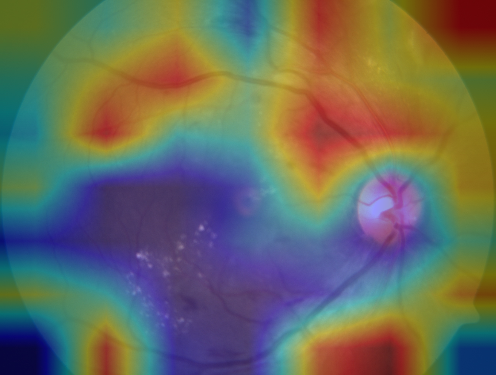
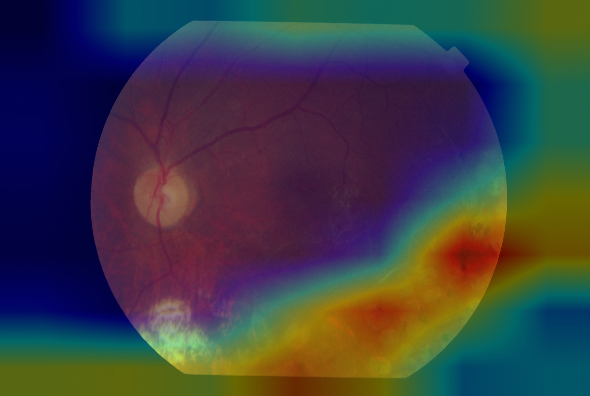
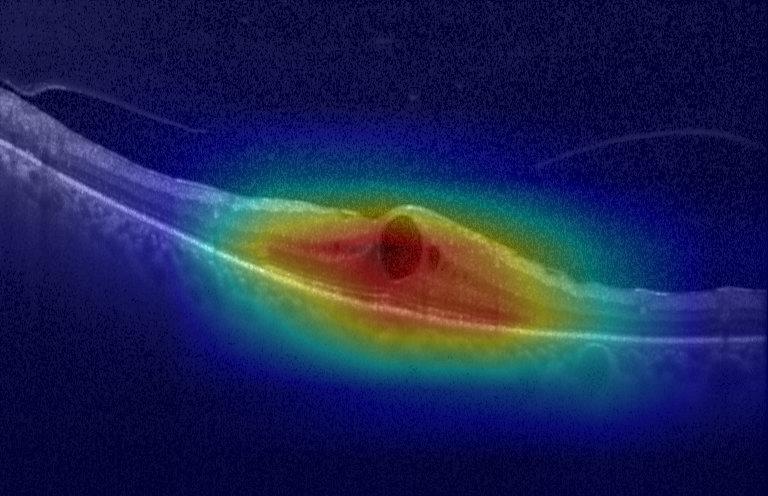
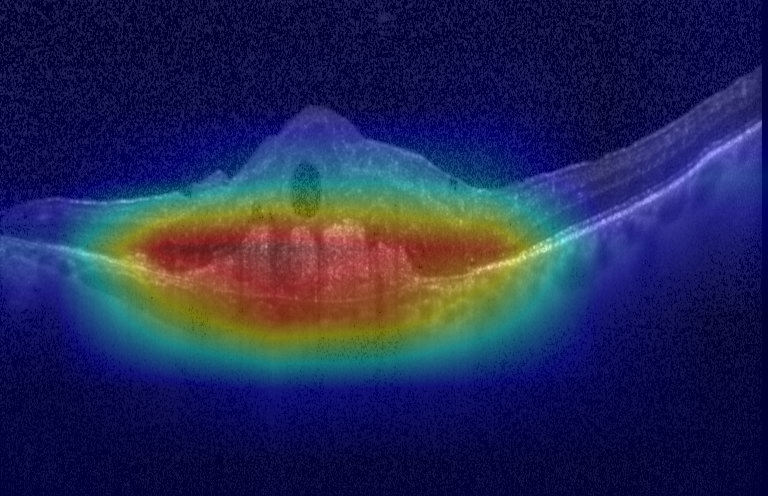

# Multimodal Retina Disease Detection (Fundus + OCT Fusion)

This project implements a **multimodal deep learning pipeline** for retinal disease detection using **fundus photographs** and **OCT B-scans**, mirroring how modern ophthalmology labs combine multiple imaging modalities in practice.

---

We train three models:

1. 🩺 **Fundus-only CNN** for diabetic retinopathy (DR) severity classification  
2. 👁 **OCT-only CNN** for structural retinal disease classification  
3. 🔗 **Fusion model** that combines fundus + OCT embeddings for binary disease detection  

> 🧠 **Fundus captures surface vascular damage, OCT captures retinal layer structure – together they provide a stronger diagnostic signal than either alone.**

---

## 📌 Dataset Sources

### 1️⃣ Fundus – APTOS 2019 Diabetic Retinopathy

- 3662 labeled color fundus photographs  
- 5-class DR severity scale:
  - `0` – No DR  
  - `1` – Mild  
  - `2` – Moderate  
  - `3` – Severe  
  - `4` – Proliferative DR  

Fundus images are used to train the **DR severity classifier**.

---

### 2️⃣ OCT – Kermany 2018 Retinal OCT

- Grayscale OCT B-scans  
- 4 disease classes:
  - `CNV`  
  - `DME`  
  - `DRUSEN`  
  - `NORMAL`  

OCT images are used to train the **OCT disease classifier** and to provide the second modality for fusion.

> ⚠️ The fundus and OCT datasets are **not from the same patients**. For the fusion model, we align labels (normal vs disease) and create *virtual multimodal pairs*.

---

## 🧱 Pipeline Overview

flowchart LR
    F[Fundus image] --> FEnc[Fundus Encoder (EffNet-B0)]
    O[OCT B-scan]   --> OEnc[OCT Encoder (ResNet-18)]
    FEnc --> Z[Concatenate embeddings]
    OEnc --> Z
    Z --> Head[MLP Fusion Head]
    Head --> Y[Normal vs Disease]

### Core steps:

1. Train fundus DR classifier

2. Train OCT disease classifier

3. Freeze both encoders and train a fusion head on top of concatenated embeddings

4. Use Grad-CAM to visualize where each model is “looking”

## 🩺 Model 1 – Fundus DR Classification (EfficientNet-B0)

Backbone: tf_efficientnet_b0 (via timm)

Input: RGB fundus image

Task: 5-class DR severity

Loss: Cross-entropy

Augmentation: flips, rotations, brightness/contrast and color jitter

Framework: PyTorch + timm + Albumentations

Validation Accuracy: ~0.81

Most confident on:

✅ No DR

✅ Moderate DR

More challenging:

⚠ Severe / proliferative DR (class imbalance & subtle differences)

## 👁 Explainability with Grad-CAM

Grad-CAM is used to visualize **where the network is focusing inside the image** when making a prediction.  
This helps verify that the model is learning **clinically meaningful retinal features**, such as:

- microaneurysms  
- hemorrhages  
- exudates  
- retinal layer disruptions  

Explainability is critical in medical AI — it improves transparency, trust, and clinical interpretability.

---

## 🩺 Fundus Explainability — Correct vs Misclassified Examples

### ✅ Correct Prediction — Moderate DR

  

<i>
The network highlights vascular abnormalities consistent with Moderate DR.  
(True = 2, Predicted = 2)
</i>

### ⚠ Misclassification — Severe DR

  

<i>
The model over-grades the case to Proliferative DR, likely due to dense lesion regions.  
(True = 3, Predicted = 4)
</i>

---

## 🧠 OCT Explainability — Disease-Specific Attention

### 🌊 Diabetic Macular Edema (DME)

  

<i>
Grad-CAM highlights macular thickening and fluid-related structural change.  
(True = DME, Predicted = DME)
</i>

### 🩸 Choroidal Neovascularization (CNV)

  

<i>
Attention localizes to abnormal vascular protrusion into retinal layers.  
(True = CNV, Predicted = CNV)
</i>

---

## 🧪 Why This Matters

These visualizations:

✔ confirm the network is learning disease-relevant features  
✔ provide transparency for clinicians & researchers  
✔ reduce “black-box AI” concerns  
✔ mirror real ophthalmology AI workflows  

> 🧠 In this project, explainability is treated as a **first-class requirement**, not an optional extra.

## 📊 Result Summary

| Model              | Modality        | Task                         | Validation Accuracy |
|--------------------|-----------------|-----------------------------|---------------------|
| Fundus CNN         | Fundus          | 5-class DR severity         | ~0.81               |
| OCT CNN            | OCT             | 4-class disease             | ~1.00 (n = 32)      |
| Fusion MLP Head    | Fundus + OCT    | Binary normal vs disease    | **0.995**           |

### Key Takeaways
- ✅ **Fusion outperforms fundus-only screening**
- 👁 **OCT captures structural pathology very strongly**
- 🔗 **Multimodal imaging = stronger diagnostic signal**
- 🏥 **Matches real-world retina clinic workflow**

## 📦 Tech Stack

PyTorch – core deep learning framework

timm – modern CNN backbones (EfficientNet, ResNet)

Albumentations – image augmentation

scikit-learn – metrics & utilities

Grad-CAM – model explainability

NumPy / Pandas / Matplotlib – data & visualization

## 👩‍⚕️ Clinical Relevance

Fundus = vascular & surface biomarkers

OCT = retinal microstructure & macular fluid

Fusion ≈ how ophthalmologists combine modalities when making decisions

Grad-CAM provides visual evidence for where the network is focusing, which is crucial for trust in medical AI

Binary disease vs normal supports screening workflows and referral triage

This project demonstrates:

Multimodal medical AI

Deep learning engineering end-to-end

Explainability and rigorous evaluation

Reproducible, research-style pipeline design

## 🚀 Future Extensions

Train on the full OCT dataset and larger val/test splits

Multiclass fusion (joint DR grade + OCT subtype prediction)

SHAP / Integrated Gradients for richer interpretability

Patient-level aggregation and calibration analysis

Lightweight demo app (Streamlit / FastAPI) for clinicians